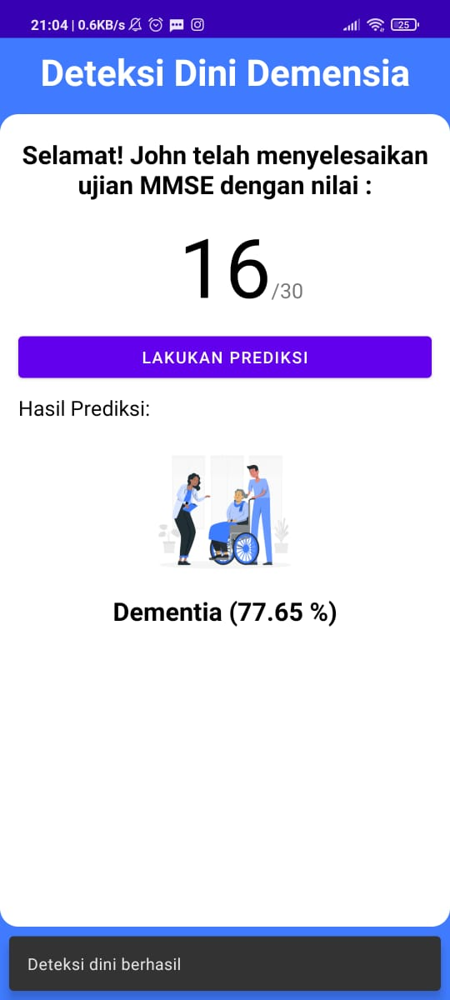

<!--
*** Thanks for checking out the Best-README-Template. If you have a suggestion
*** that would make this better, please fork the repo and create a pull request
*** or simply open an issue with the tag "enhancement".
*** Thanks again! Now go create something AMAZING! :D
-->


<!-- PROJECT SHIELDS -->
<!--
*** I'm using markdown "reference style" links for readability.
*** Reference links are enclosed in brackets [ ] instead of parentheses ( ).
*** See the bottom of this document for the declaration of the reference variables
*** for contributors-url, forks-url, etc. This is an optional, concise syntax you may use.
*** https://www.markdownguide.org/basic-syntax/#reference-style-links
-->
[![Contributors][contributors-shield]][contributors-url]
[![Forks][forks-shield]][forks-url]
[![Issues][issues-shield]][issues-url]
[![Stargazers][stars-shield]][stars-url]


<!-- PROJECT LOGO -->
<br />
<p align="center">
  <a href="https://play.google.com/store/apps/details?id=com.bangkit.decare">
    
  </a>

  <h3 align="center">Dementia-Classification Model</h3>

  <p align="center">
    Dementia Care Linear Classifier Model.
    <br />
    <a href="https://github.com/B21-CAP0075/DeCare-Intro"><strong>Explore the docs »</strong></a>
    <br />
    <br />
    <a href="https://play.google.com/store/apps/details?id=com.bangkit.decare">View Application</a>
    ·
    <a href="https://github.com/B21-CAP0075/Dementia-Classification/issues">Report Bug</a>
    ·
    <a href="https://github.com/B21-CAP0075/Dementia-Classification/issues">Request Feature</a>
  </p>
</p>


<!-- TABLE OF CONTENTS -->
<details open="open">
  <summary>Table of Contents</summary>
  <ol>
    <li>
      <a href="#about-the-project">About The Project</a>
      <ul>
        <li><a href="#built-with">Built With</a></li>
      </ul>
    </li>
    <li>
      <a href="#getting-started">Getting Started</a>
      <ul>
        <li><a href="#prerequisites">Prerequisites</a></li>
        <li><a href="#installation">Installation</a></li>
        <li><a href="#installation">Dataset</a></li>
        <li><a href="#installation">Source Articles and Journals</a></li>
      </ul>
    </li>
    <li><a href="#contact">Contact</a></li>
    <li><a href="#acknowledgements">Acknowledgements</a></li>
  </ol>
</details>


<!-- ABOUT THE PROJECT -->
## About The Project



DeCare is an Android application to support in-home caregiver to improve quality of dementia patient's life. DeCare can perform early detection of dementia using MMSE Screening. The results of MMSE Screening and the patient's personal data will be analyzed by a Machine Learning model from Cloud to predict whether the patient is suffering from dementia or not. With this model, we can tell that a person has dementia or not by using their personal information such as Age, Socioeconomic Status, Education Level, Gender, and MMSE Test Result.

### Built With

This model is built with
* [Tensorflow](https://www.tensorflow.org/)
* [Keras](https://keras.io/)
* [Numpy](https://numpy.org/)
* [Matplotlib](https://matplotlib.org/)
* [Scikit-Learn](https://scikit-learn.org/stable/)
* [Seaborn](https://seaborn.pydata.org/)

<!-- GETTING STARTED -->
## Getting Started

To get a local copy up and running follow these simple steps.

### Prerequisites

We use Google Colab Services to create the model so just make sure you have internet connection and browser as prerequisites.

### Installation

1. Make sure that you already install Git or Download this file to ZIP
2. clone this repository using Git
```shell
git clone https://github.com/B21-CAP0075/Dementia-Classification
```
3. Change to the directory using your jupiter editor or upload it to colabs


## Dataset

- [MRI and Alzheimer](https://www.kaggle.com/jboysen/mri-and-alzheimers)

  We use the MRI and Alzheimer dataset to implement the model we use. This is a proper model because there are sufficient data with minimum missing value. 
  
## Source Articles and Journals

- [Early Detection of Dementia: Advances, Challenges, and Future Prospects](https://www.researchgate.net/publication/316699181_Early_Detection_of_Dementia_Advances_Challenges_and_Future_Prospects)
- [Dementia Prediction on OASIS Dataset using Supervised and Ensemble Learning Techniques](https://www.ijeat.org/wp-content/uploads/papers/v10i1/A18271010120.pdf)
- [Alzi](https://alzi.or.id/)
- [Neural Network Design](https://www.researchgate.net/publication/347005722_Design_of_Artificial_Neural_Networks_for_Early_Detection_of_Dementia_Risk_Using_Mini-Mental_State_of_Examination_MMSE )

<!-- CONTACT -->
## Contact Us

Muhammad Ayyub Abdurrahman - M0020111@bangkit.academy <br />
Ahmad Emir Alfatah  - A3152838@bangkit.academy <br />
Dharma Yudistira Eka Putra - A1311646@bangkit.academy <br />
Ria Rizky Mardiana  - C0070700@bangkit.academy  <br />
Muhammad Ridho Anshory - C1161495@bangkit.academy <br />
Jessica Julia Paradina Siregar - M3152837@bangkit.academy <br />

Project Link: [B21-CAP0075](https://github.com/B21-CAP0075)

<!-- ACKNOWLEDGEMENTS -->
## Acknowledgements
* [Bangkit Academy](https://grow.google/intl/id_id/bangkit/)
* [AlZi](https://alzi.or.id/)


<!-- MARKDOWN LINKS & IMAGES -->
<!-- https://www.markdownguide.org/basic-syntax/#reference-style-links -->
[contributors-shield]: https://img.shields.io/github/contributors/othneildrew/Best-README-Template.svg?style=for-the-badge
[contributors-url]: https://github.com/B21-CAP0075/Dementia-Classification/graphs/contributors
[forks-shield]: https://img.shields.io/github/forks/othneildrew/Best-README-Template.svg?style=for-the-badge
[forks-url]: https://github.com/B21-CAP0075/Dementia-Classification/network/members
[stars-shield]: https://img.shields.io/github/stars/othneildrew/Best-README-Template.svg?style=for-the-badge
[stars-url]: https://github.com/B21-CAP0075/Dementia-Classification/stargazers
[issues-shield]: https://img.shields.io/github/issues/othneildrew/Best-README-Template.svg?style=for-the-badge
[issues-url]: https://github.com/B21-CAP0075/Dementia-Classification/issues
[product-screenshot]: product.jpeg
